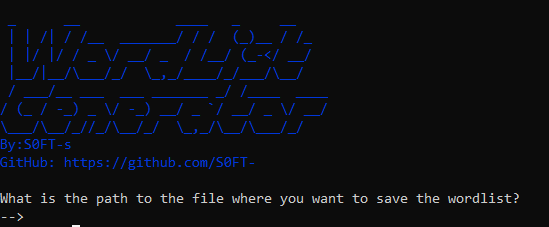

# Wordlist_generator

# features

- customized spaces
- personalized information

## [+] what do you need to run the code

### go to your terminal and put
-  $ pip install itertools
-  $ pip install colorama

## [+] How to run the code 

### to run the code just type in the terminal
- $ python wowordlist.py
- now just have fun 

# Have a good day :wave:
